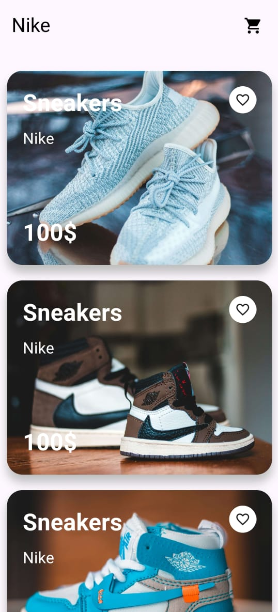
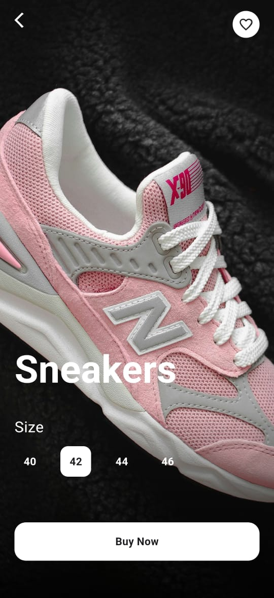

# 👟 Animated Shoe UI App

  

The **Animated Shoe UI App** is a Flutter-based mobile application that showcases a sleek, animated interface for displaying various shoe designs. This app is a perfect example of modern UI design and animation in Flutter, providing an engaging and visually appealing user experience.

## 🚀 Features

- 🎨 **Stylish Animations**: Smooth and visually appealing animations for a dynamic UI experience.
- 🖼️ **Interactive UI**: Responsive elements that enhance user interaction.
- 🔧 **Customizable Animations**: Easily adjustable animations to fit different design needs.
- 📱 **High-Quality Design**: Modern and clean UI focusing on shoe aesthetics and interaction.

## 📱 Screenshots

| Home Screen | Shoe Detail | 
|:-----------:|:-----------------:|
|  |  |

## 📦 Installation

Follow these steps to get started with the Corona Tracker App:

1. **Clone the repository**:
  https://github.com/huzaifaAhmad9/Animated-Shoes-UI.git

2. **Navigate to the project directory**:
   cd animated-shoes-ui

3. **Install the required dependencies**:
   flutter pub get

4. **Run the app**:
   flutter run

## 🛠 Built With

- **Flutter** - A UI toolkit for building natively compiled applications for mobile from a single codebase.
- **Dart** - Programming language optimized for building mobile, desktop, server, and web applications.
- **Custom Animations** - Designed specifically for an interactive and engaging UI experience.

## 🧑‍💻 Contributing

We welcome contributions to enhance the Corona Tracker App. To contribute, follow these steps:
- Fork the repository.
- Create a new branch (git checkout -b feature/YourFeature).
- Commit your changes (git commit -m 'Add some feature').
- Push to the branch (git push origin feature/YourFeature).
- Open a pull request.

## 👤 Contact

Feel free to reach out if you have any questions or suggestions:

- **Email**: huzaifaahmad4001@gmail.com
